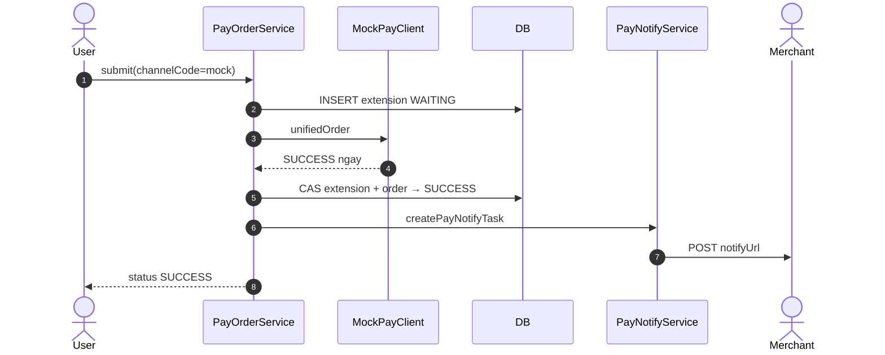
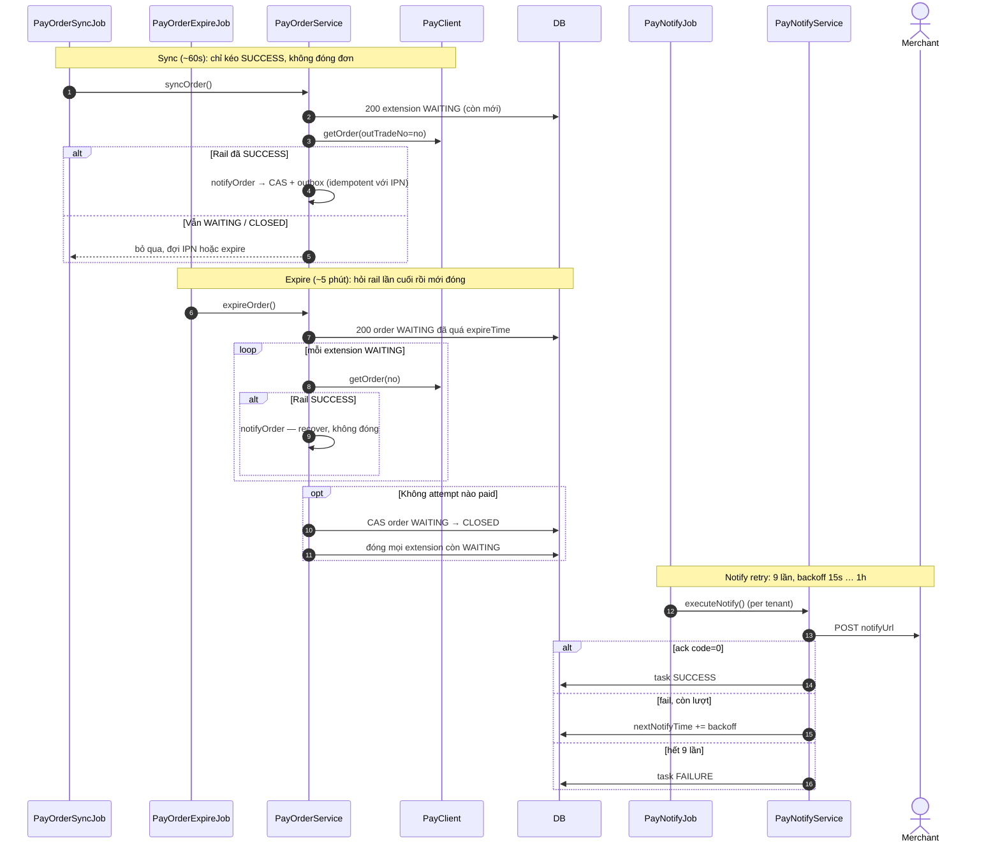
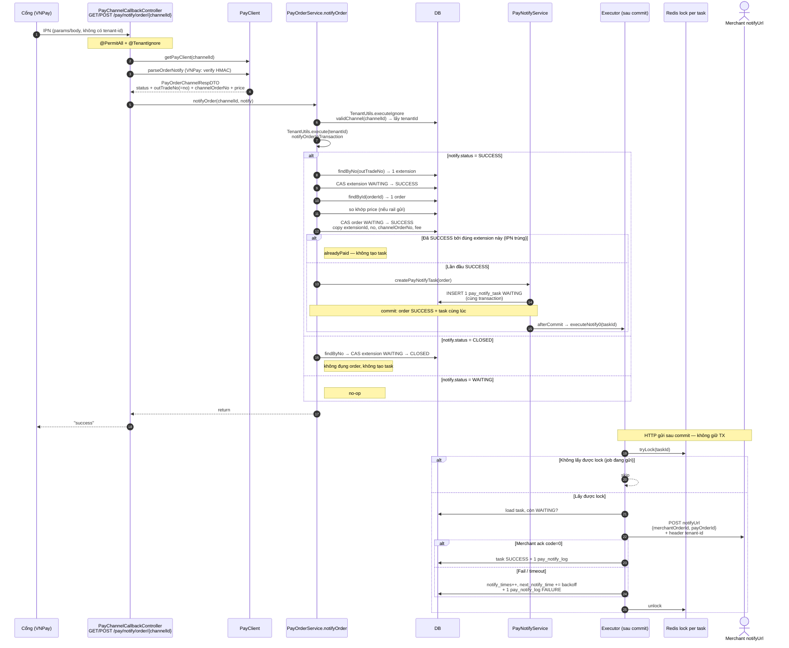
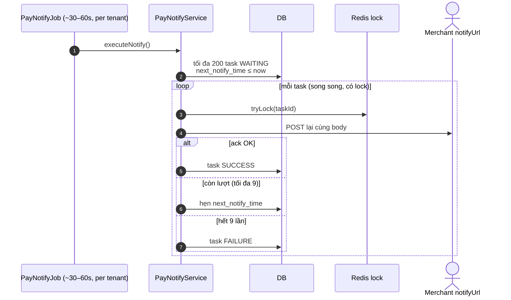
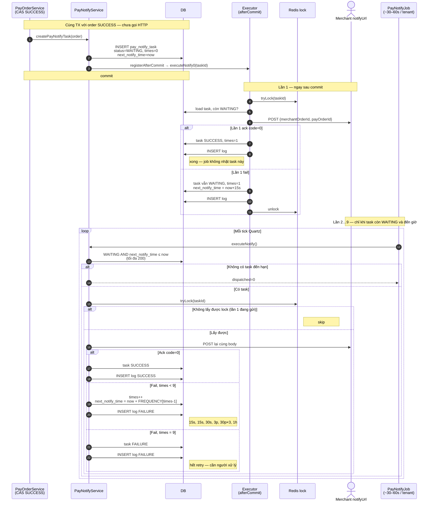

Luồng thanh toán thật (cổng async kiểu VNPay) tách **3 pha**: tạo đơn → submit kênh → IPN settle + notify merchant.

## Happy path (VNPay / cổng async)

```mermaid
sequenceDiagram
    autonumber
    actor Merchant as Merchant<br/>(module nghiệp vụ)
    participant Api as PayOrderApi
    participant Svc as PayOrderService
    participant Redis as Redis<br/>(PayNoRedisDAO)
    participant DB as DB
    participant Client as PayClient<br/>(VNPay)
    actor User as User / Browser
    participant Rail as Cổng thanh toán
    participant CB as PayChannelCallbackController
    participant Outbox as PayNotifyService

    Note over Merchant,Outbox: Pha 1 — create: chưa chọn kênh, PayOrder.no = null

    Merchant->>Api: createOrder(appKey, merchantOrderId, price, …)
    Api->>Svc: createOrder
    Svc->>DB: validApp(appKey)
    Svc->>DB: findByAppIdAndMerchantOrderId
    alt Đã tồn tại (idempotent)
        Svc-->>Merchant: orderId cũ
    else Đơn mới
        Svc->>DB: INSERT pay_order WAITING<br/>notifyUrl ← app.orderNotifyUrl
        Svc-->>Merchant: orderId mới
    end

    Note over User,Client: Pha 2 — submit: chọn kênh, sinh no, gọi rail

    User->>Svc: POST /pay/order/submit<br/>{id, channelCode, returnUrl}
    Svc->>DB: order WAITING? chưa hết hạn?<br/>chưa có extension SUCCESS?
    Svc->>DB: validChannel(appId, channelCode)
    Svc->>Redis: generate("P") → no
    Svc->>DB: INSERT pay_order_extension WAITING<br/>no = PyyyyMMddHHmmssN
    Svc->>Client: unifiedOrder(outTradeNo=extension.no,<br/>notifyUrl=/pay/notify/order/{channelId})
    Client->>Client: ký + ghép redirect URL (không HTTP outbound)
    Client-->>Svc: WAITING + displayContent (URL)
    Note right of Svc: notifyOrder với WAITING = no-op
    Svc-->>User: status WAITING + URL thanh toán

    User->>Rail: mở URL, thanh toán
    Rail-->>User: redirect returnUrl (chỉ UI)

    Note over Rail,Outbox: Pha 3 — IPN: settle theo no, copy no lên order, outbox notify

    Rail->>CB: IPN GET/POST /pay/notify/order/{channelId}
    CB->>Client: parseOrderNotify (verify HMAC)
    Client-->>CB: SUCCESS + outTradeNo + channelOrderNo
    CB->>Svc: notifyOrder(channelId, notify)
    Svc->>DB: load channel @TenantIgnore → chạy trong tenant của channel
    Svc->>DB: CAS extension WAITING → SUCCESS<br/>match by no = outTradeNo
    Svc->>DB: CAS order WAITING → SUCCESS<br/>copy extensionId, no, channelOrderNo, fee
    Svc->>Outbox: createPayNotifyTask (cùng transaction)
    Outbox->>DB: INSERT pay_notify_task WAITING

    Note over Outbox,Merchant: afterCommit — fast-path; PayNotifyJob là backstop

    Outbox->>Merchant: POST notifyUrl<br/>{merchantOrderId, payOrderId}
    Merchant->>Api: getOrder(payOrderId) — nguồn sự thật
    Merchant-->>Outbox: CommonResult.code = 0
    Outbox->>DB: task SUCCESS
```

Điểm quan trọng trên diagram:

- **`merchant_order_id`** đi từ merchant lúc create, và được echo lại lúc notify.
- **`no`** sinh lúc submit, gửi rail như `outTradeNo`; chỉ được copy lên `PayOrder` khi CAS SUCCESS.
- Callback **không mang tenant-id**; tenant lấy từ channel rồi mới settle.

## Mock (SUCCESS ngay lúc submit)

`MockPayClient.unifiedOrder` trả `SUCCESS` luôn → bước 3 chạy **trong cùng request submit**, không cần IPN.



## Recovery nếu IPN rơi / đơn hết hạn



Merchant **không settle tiền từ body notify** — payload chỉ có `merchantOrderId` + `payOrderId`; phải gọi lại `PayOrderApi.getOrder` để lấy status/amount chính thức.


Đoạn này bắt đầu khi cổng gọi IPN. Browser lúc đó **đã** (hoặc sắp) về `returnUrl` — không nằm trong diagram này.

## Callback → settle → tạo 1 task → POST merchant



## Nếu merchant chưa ack — job bù



Luồng này **không** scan `pay_order`. Mỗi IPN: 1 `outTradeNo` → 1 extension → 1 order → tối đa **1** task (chỉ lần SUCCESS đầu). Job sau chỉ quét `pay_notify_task` đã đến hạn để gửi HTTP lại.

Luồng **một** `pay_notify_task`: tạo lúc CAS → gửi lần 1 → retry theo backoff.



Backoff nằm lúc ghi fail: `next_notify_time = now + NOTIFY_FREQUENCY[attempt - 1]`. Job không ngủ đúng 15s — nó hỏi định kỳ: task nào `next_notify_time` đã tới thì gửi.