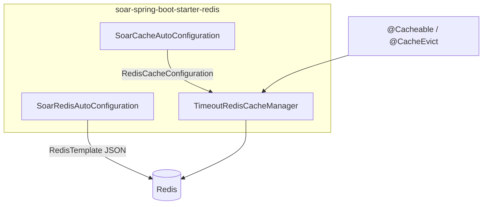
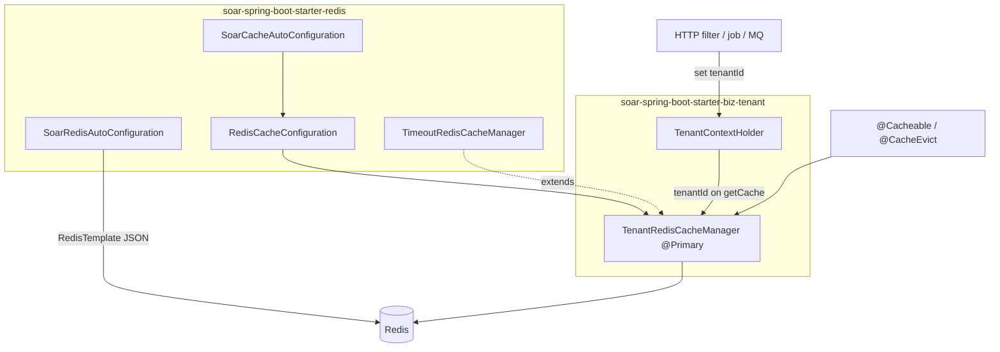
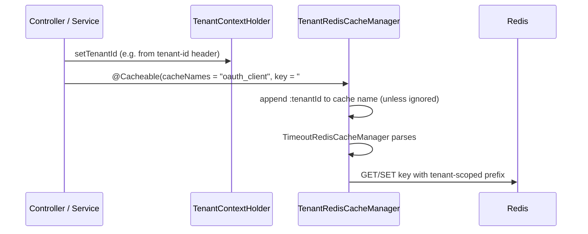

# soar-spring-boot-starter-redis

Spring Boot starter that wraps **Spring Data Redis** and **Spring Cache**, with **Redisson** as the underlying client. It provides two complementary ways to use Redis: imperative access via `RedisTemplate`, and declarative caching via `@Cacheable` / `@CacheEvict`.

## Overview

| Component | Class | Responsibility |
|-----------|--------|----------------|
| Redis operations | `SoarRedisAutoConfiguration` | `RedisTemplate<String, Object>` with JSON values |
| Annotation cache | `SoarCacheAutoConfiguration` | `RedisCacheManager`, `@EnableCaching` |
| Per-cache TTL | `TimeoutRedisCacheManager` | TTL suffix in `cacheNames` (`name#ttl`) |
| Soar-specific settings | `SoarCacheProperties` | Redis `SCAN` batch size for cache eviction |
| Multi-tenant cache *(optional)* | `TenantRedisCacheManager` | Tenant-scoped cache names when `soar-spring-boot-starter-biz-tenant` is present |

### Architecture (single-tenant)



### Architecture (multi-tenant)

When the tenant starter is on the classpath, it registers a `@Primary` `TenantRedisCacheManager` that extends `TimeoutRedisCacheManager`. Spring Cache annotations then flow through the tenant-aware manager.



## Dependencies

- **Redisson** (`redisson-spring-boot-starter`) — connection pool and Redis client
- **spring-boot-starter-cache** — Spring Cache abstraction
- **jackson-datatype-jsr310** — `java.time` types in JSON (via `JavaTimeModule`)

Add the starter to your module:

```xml
<dependency>
    <groupId>com.hdl.boot</groupId>
    <artifactId>soar-spring-boot-starter-redis</artifactId>
</dependency>
```

Auto-configuration classes are registered via Spring Boot 3 `@AutoConfiguration`:

- `com.hdl.soar.framework.redis.config.SoarRedisAutoConfiguration`
- `com.hdl.soar.framework.redis.config.SoarCacheAutoConfiguration`

---

## SoarRedisAutoConfiguration — RedisTemplate

Creates a custom `RedisTemplate<String, Object>` **before** Redisson’s default template so the application uses a single, consistent serializer setup.

| Part | Serializer | Notes |
|------|------------|--------|
| Key / hash key | `String` | Human-readable keys in Redis CLI and desktop tools |
| Value / hash value | Jackson JSON | Shared via `buildRedisSerializer()` |

### JavaTimeModule (`Instant`, `LocalDateTime`, etc.)

`buildRedisSerializer()` registers Jackson’s `JavaTimeModule` on the internal `ObjectMapper`:

```java
RedisSerializer<Object> json = RedisSerializer.json();
ObjectMapper objectMapper = (ObjectMapper) ReflectUtil.getFieldValue(json, "mapper");
objectMapper.registerModules(new JavaTimeModule());
```

**Keep this registration** if cached or stored objects contain any `java.time` type (`Instant`, `LocalDateTime`, `ZonedDateTime`, …). `JavaTimeModule` is not limited to `LocalDateTime` — switching fields to `Instant` still requires it.

Without `JavaTimeModule`, Jackson typically fails with errors such as:

```text
Java 8 date/time type `java.time.Instant` not supported by default
```

You can omit it only when values never include `java.time` types serialized by Jackson (e.g. plain `String`, `Long`, or manual epoch conversion).

### Usage — direct Redis access

You own the **full key string**:

```java
@Resource
private RedisTemplate<String, Object> redisTemplate;

public void example(Long userId, UserDTO user) {
    redisTemplate.opsForValue().set("session:" + userId, user);
    UserDTO cached = (UserDTO) redisTemplate.opsForValue().get("session:" + userId);
}
```

Use `RedisTemplate` when:

- TTL varies per entry (e.g. OAuth2 access tokens)
- Keys do not fit the `cacheName + businessKey` pattern
- You need hashes, lists, or other structures beyond Spring Cache

---

## SoarCacheAutoConfiguration — Spring Cache on Redis

Enables `@EnableCaching` and wires Redis as the cache backend.

| Bean | Role |
|------|------|
| `RedisCacheConfiguration` (`@Primary`) | Default serialization, key prefix, TTL, null caching |
| `RedisCacheManager` | `TimeoutRedisCacheManager` with non-locking writer and `SCAN` batching |

`RedisCacheManager` reuses the **same** `RedisConnectionFactory` as `RedisTemplate` — no second connection setup.

> **Multi-tenant apps:** `soar-spring-boot-starter-biz-tenant` replaces this bean with `TenantRedisCacheManager` (`@Primary`). `RedisCacheConfiguration` from this starter is still used; only the manager implementation changes.

### Key prefix — single colon `:`

Spring’s default Redis cache keys often look like `cacheName::key` (double colon). Soar uses a **single colon** for readability in tools such as Redis Insight / Redis Desktop Manager:

```text
oauth_client:my-client-id     ← Soar style
oauth_client::my-client-id    ← Spring default (not used)
```

Prefix is built in `redisCacheConfiguration()` via `computePrefixWith`.

### Value serialization

Cache values use the same `buildRedisSerializer()` as `RedisTemplate`, so manual Redis writes and `@Cacheable` entries stay compatible when using the same types.

---

## Redis key structure (Spring Cache)

Spring Cache and `RedisTemplate` use **different key models**. Do not assume they share key patterns unless you design them to.

### Formula

```text
[globalKeyPrefix][cacheName]:[businessKey]
```

| Segment | Source | Example |
|---------|--------|---------|
| `globalKeyPrefix` | `spring.cache.redis.key-prefix` (optional) | `soar:` |
| `cacheName` | `@Cacheable(cacheNames = "...")` | `oauth_client` |
| `businessKey` | `@Cacheable(key = "...")` SpEL | `default-client-id` |

### Examples

**No global prefix**

```java
@Cacheable(cacheNames = "oauth_client", key = "#clientId")
```

Redis key: `oauth_client:default-client-id`

**With global prefix** (`spring.cache.redis.key-prefix: soar`)

Redis key: `soar:oauth_client:default-client-id`

**With `key-prefix` already ending in `:`** (`soar:`)

Configuration normalizes trailing colons — you get `soar:oauth_client:...`, not `soar::oauth_client:...`.

### Per-cache TTL in `cacheNames` — does not appear in the key

`TimeoutRedisCacheManager` supports:

```java
@Cacheable(cacheNames = "role#30m", key = "#id")
```

| Part | Purpose |
|------|---------|
| `role` | Actual cache name in Redis |
| `#30m` | TTL only (stripped from the key) |

Redis key remains: `role:42` (plus optional global prefix). TTL units: `d` days, `h` hours, `m` minutes, `s` seconds; plain number defaults to seconds.

If `cacheNames` does not match `name#ttl` (exactly one `#`), the global TTL from `spring.cache.redis.time-to-live` applies.

### With multi-tenant enabled

See [Multi-tenant mode (optional)](#multi-tenant-mode-optional). Summary:

```text
[globalKeyPrefix][cacheName]:[tenantId]:[businessKey]
```

Ignored caches (`soar.tenant.ignore-caches`) keep the single-tenant shape without `[tenantId]`.

### Comparison: Template vs Cache

```text
RedisTemplate:
  YOU define the full key  →  "session:12345"
  value = JSON

@Cacheable (single-tenant):
  Framework builds key     →  "cacheName:businessKey"
  (+ optional global prefix)
  #ttl affects TTL only, not the key

@Cacheable (multi-tenant):
  Framework builds key     →  "cacheName:tenantId:businessKey"
  (+ optional global prefix; ignore-caches exempt)
```

---

## TimeoutRedisCacheManager

Extends Spring’s `RedisCacheManager` to parse `cacheNames` in the form `logicalName#ttl`.

```java
@Cacheable(cacheNames = "dept_children_ids#1h", key = "#id")
public Set<Long> getChildDeptIdListFromCache(Long id) { ... }
```

- Cache logical name: `dept_children_ids`
- TTL: 1 hour
- Redis key: `dept_children_ids:{id}`

Eviction must use the **same** `cacheNames` and `key` expression as `@Cacheable`, or stale entries remain in Redis.

---

## Multi-tenant mode (optional)

Multi-tenant support lives in **`soar-spring-boot-starter-biz-tenant`**, not in this Redis starter alone. Add both starters when building a SaaS deployment:

```xml
<dependency>
    <groupId>com.hdl.boot</groupId>
    <artifactId>soar-spring-boot-starter-redis</artifactId>
</dependency>
<dependency>
    <groupId>com.hdl.boot</groupId>
    <artifactId>soar-spring-boot-starter-biz-tenant</artifactId>
</dependency>
```

### How tenant isolation works for Spring Cache

`TenantRedisCacheManager` extends `TimeoutRedisCacheManager`. On `getCache(String name)` it:

1. Splits `name` by `#` and uses the **first segment** as the logical cache name (for `ignoreCaches` checks and TTL parsing).
2. If multi-tenant mode is active, a tenant id is present in `TenantContextHolder`, and the cache is not ignored — appends `:tenantId` to the cache name **before** delegating to the parent manager.
3. The parent manager continues to handle `#ttl` suffixes and builds Redis keys as usual.



### Tenant-scoped Redis key formula

When tenant isolation applies to a cache:

```text
[globalKeyPrefix][cacheName]:[tenantId]:[businessKey]
```

| Segment | Example |
|---------|---------|
| `globalKeyPrefix` | `soar:` (optional) |
| `cacheName` | `oauth_client` |
| `tenantId` | `1001` |
| `businessKey` | `default-client-id` |

**Example** — tenant `1001`, no global prefix:

```java
@Cacheable(cacheNames = RedisKeyConstants.OAUTH_CLIENT, key = "#clientId")
```

Redis key: `oauth_client:1001:default-client-id`

**With global prefix** (`spring.cache.redis.key-prefix: soar`):

```text
soar:oauth_client:1001:default-client-id
```

**With per-cache TTL** (`cacheNames = "role#30m"`):

- TTL `30m` is parsed by `TimeoutRedisCacheManager` and does **not** appear in the key.
- Tenant suffix is applied to the logical cache region; final key shape is equivalent to: `role:1001:42` for business key `42`.

### When tenant suffix is **not** applied

`TenantRedisCacheManager` skips tenant suffix if **any** of the following is true:

| Condition | Typical use case |
|-----------|------------------|
| `TenantContextHolder.isIgnore()` is `true` | System jobs, callbacks, cross-tenant maintenance |
| `TenantContextHolder.getTenantId()` is `null` | Open APIs, webhooks without tenant header |
| Cache name is listed in `soar.tenant.ignore-caches` | Shared dictionary data, global templates |

For ignored caches, keys match the **single-tenant** formula: `[prefix][cacheName]:[businessKey]`.

### Configuration — `soar.tenant`

```yaml
soar:
  tenant:
    enable: true
    ignore-urls:
      - /admin-api/pay/notify/**   # callbacks without tenant-id header
    ignore-visit-urls:
      - /admin-api/system/auth/**
    ignore-tables:
      - sys_dict_data              # optional: tables without tenant_id column
    ignore-caches:
      - oauth_client               # shared across tenants
      - sms_template
      - notify_template
```

| Property | Effect on Redis cache |
|----------|------------------------|
| `soar.tenant.enable` | Master switch for tenant features |
| `soar.tenant.ignore-caches` | Cache names that stay global (no `:tenantId` segment) |
| `soar.tenant.ignore-urls` | Requests that may omit `tenant-id` (see tenant web filter) |

Use `ignore-caches` for data that is identical for every tenant (OAuth client registry, SMS templates, etc.). All other caches should remain tenant-scoped to prevent cross-tenant data leaks.

### `RedisTemplate` and multi-tenant

`TenantRedisCacheManager` only affects **Spring Cache** (`@Cacheable`, etc.). It does **not** rewrite keys for `RedisTemplate`.

For direct `RedisTemplate` usage in a multi-tenant app, **include the tenant id in the key yourself**:

```java
Long tenantId = TenantContextHolder.getTenantId();
redisTemplate.opsForValue().set(
    "session:" + tenantId + ":" + userId,
    session
);
```

Failing to do so can cause tenants to read or overwrite each other’s data.

### Tenant context sources

`TenantContextHolder` is populated by the tenant starter (for example):

- **HTTP** — `tenant-id` request header via servlet filter
- **Security** — validated against the logged-in user’s tenant
- **Jobs / MQ** — `TenantUtils.execute(tenantId, …)` or message headers

Ensure `@Cacheable` methods run only after the tenant id is set on the request thread (or explicit `TenantUtils` scope).

### Bean wiring with tenant enabled

| Bean | `@Primary` | Notes |
|------|------------|--------|
| `RedisCacheConfiguration` | Yes (from this starter) | Shared serialization and key prefix rules |
| `TimeoutRedisCacheManager` | No | Base implementation; superseded when tenant starter is active |
| `TenantRedisCacheManager` | Yes (from tenant starter) | Same `RedisCacheWriter` / `SCAN` batch size via `SoarCacheProperties` |

`SoarCacheAutoConfiguration` always defines `RedisCacheConfiguration`. The tenant module’s `SoarTenantAutoConfiguration` registers `tenantRedisCacheManager` as the active `RedisCacheManager` bean.

### Multi-tenant checklist

1. Add `soar-spring-boot-starter-biz-tenant` alongside this starter.
2. List global caches under `soar.tenant.ignore-caches`; keep everything else tenant-scoped.
3. Use the same `cacheNames` and `key` in `@CacheEvict` as in `@Cacheable` (tenant suffix is automatic; do not hard-code tenant id in SpEL).
4. For `RedisTemplate`, embed `tenantId` in every application-defined key.
5. Verify keys in Redis Insight: tenant caches should contain `:tenantId:` between cache name and business key.

---

## Configuration reference

### Spring Boot — Redis connection

Standard Spring Data Redis properties (example):

```yaml
spring:
  data:
    redis:
      host: localhost
      port: 6379
      password: # optional
      database: 0
```

### Spring Boot — Cache

```yaml
spring:
  cache:
    type: REDIS
    redis:
      time-to-live: 1h              # Default TTL for all caches
      key-prefix: soar              # Optional global prefix (Soar apps)
      cache-null-values: true       # Store null results (default true)
      use-key-prefix: true          # Set false to disable key prefixing
```

| Property | Effect |
|----------|--------|
| `spring.cache.type=REDIS` | Use Redis as the cache backend |
| `spring.cache.redis.time-to-live` | Default entry TTL |
| `spring.cache.redis.key-prefix` | Prepended to every cache key |
| `spring.cache.redis.cache-null-values` | When `false`, `@Cacheable` does not cache `null` |
| `spring.cache.redis.use-key-prefix` | When `false`, disables prefix logic |

### Soar — cache tuning

```yaml
soar:
  cache:
    redis-scan-batch-size: 30   # Default: 30
```

Used by `RedisCacheWriter` with `BatchStrategies.scan()` when evicting or clearing entries by pattern. Larger batches can reduce round-trips; very large values may increase memory pressure on Redis during `SCAN`.

---

## Usage guide

### 1. Centralize cache names

Define constants (e.g. `RedisKeyConstants`) per module:

```java
public interface RedisKeyConstants {
    String OAUTH_CLIENT = "oauth_client";
    String DEPT_CHILDREN_ID_LIST = "dept_children_ids";
}
```

### 2. Annotate read methods

```java
@Cacheable(cacheNames = RedisKeyConstants.OAUTH_CLIENT, key = "#clientId",
        unless = "#result == null")
public OAuth2ClientDO getOAuth2ClientFromCache(String clientId) {
    return oauth2ClientMapper.selectByClientId(clientId);
}
```

### 3. Invalidate on writes

```java
@CacheEvict(cacheNames = RedisKeyConstants.OAUTH_CLIENT, key = "#clientId")
public void updateOAuth2Client(String clientId, OAuth2ClientSaveReqVO reqVO) {
    // ...
}
```

### 4. Choose Template vs Cache

| Scenario | Recommended API |
|----------|-----------------|
| Fixed cache name + SpEL key + shared TTL | `@Cacheable` |
| Dynamic TTL per key | `RedisTemplate` |
| Non-string or complex Redis structures | `RedisTemplate` |
| Method-level cache with eviction by annotation | `@Cacheable` / `@CacheEvict` |
| Multi-tenant shared config cache | `@Cacheable` + entry in `soar.tenant.ignore-caches` |
| Multi-tenant session / token with dynamic TTL | `RedisTemplate` + tenant id in key |

---

## Design notes

1. **One serializer story** — `buildRedisSerializer()` is shared by `RedisTemplate` and `RedisCacheConfiguration`; change it with care across both paths.
2. **Non-locking writer** — `RedisCacheWriter.nonLockingRedisCacheWriter` favors throughput; rare concurrent writes to the same key may race.
3. **Redisson ordering** — `SoarRedisAutoConfiguration` runs `before = RedissonAutoConfigurationV2` so the custom `RedisTemplate` bean wins.
4. **Repository auto-config** — If the main application disables `spring.data.redis.repositories.enabled`, startup stays lean when Spring Data Redis repositories are unused.
5. **Tenant cache isolation** — Provided by `TenantRedisCacheManager` in the tenant starter; this module supplies `TimeoutRedisCacheManager` and shared `RedisCacheConfiguration` only.
6. **Template is never tenant-aware** — Always prefix `RedisTemplate` keys with `tenantId` in multi-tenant deployments.

---

## Package layout

**This starter**

```text
com.hdl.soar.framework.redis
├── config
│   ├── SoarRedisAutoConfiguration.java
│   ├── SoarCacheAutoConfiguration.java
│   └── SoarCacheProperties.java
└── core
    └── TimeoutRedisCacheManager.java
```

**Tenant starter** (optional, uses classes above)

```text
com.hdl.soar.framework.tenant
├── config
│   └── SoarTenantAutoConfiguration.java   # tenantRedisCacheManager @Primary
└── core
    ├── context
    │   └── TenantContextHolder.java
    └── redis
        └── TenantRedisCacheManager.java   # extends TimeoutRedisCacheManager
```

---

## Related reading

- [Spring Boot — Caching](https://docs.spring.io/spring-boot/reference/io/caching.html)
- [Spring Data Redis — Redis Cache](https://docs.spring.io/spring-data/redis/reference/redis/redis-cache.html)
- [Redisson Spring Boot starter](https://github.com/redisson/redisson/wiki/2.-Configuration#22-spring-boot-starter)
