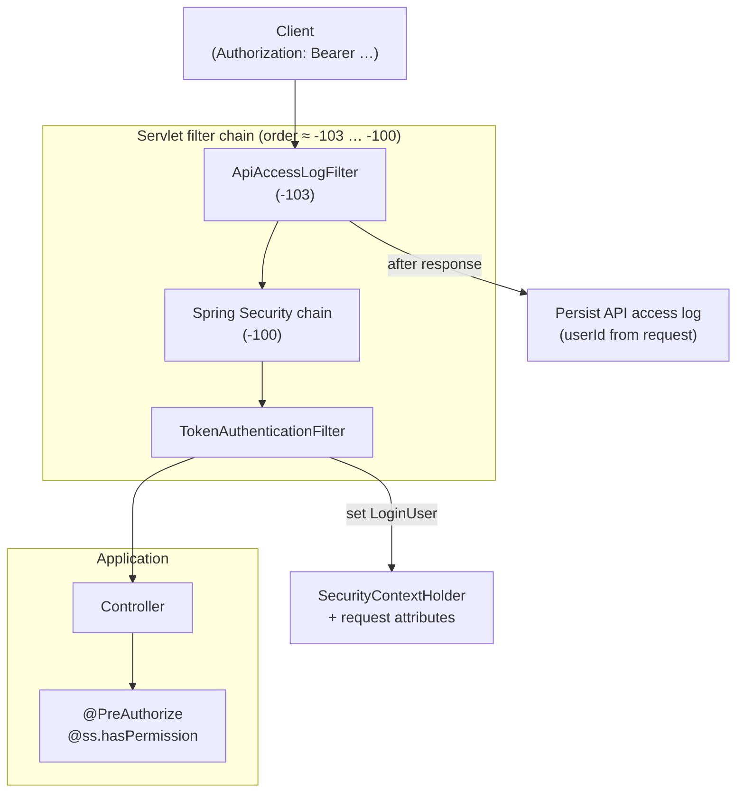
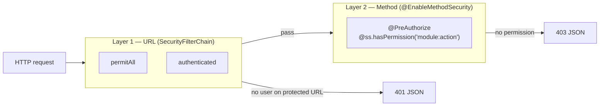
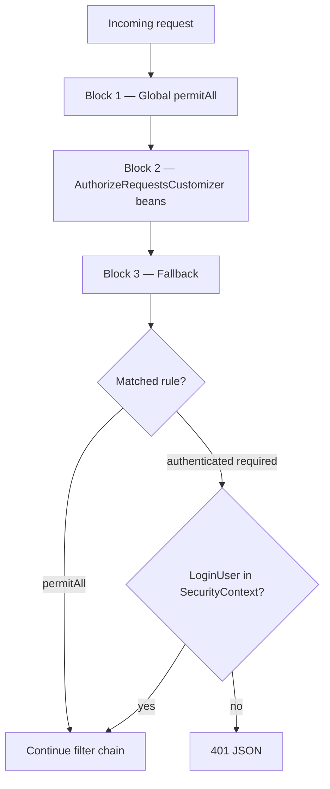
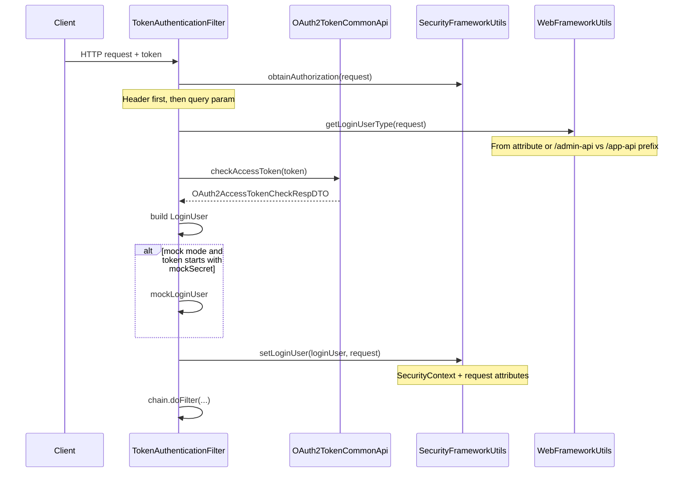
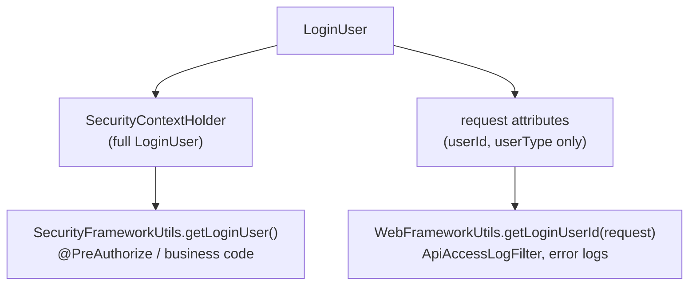
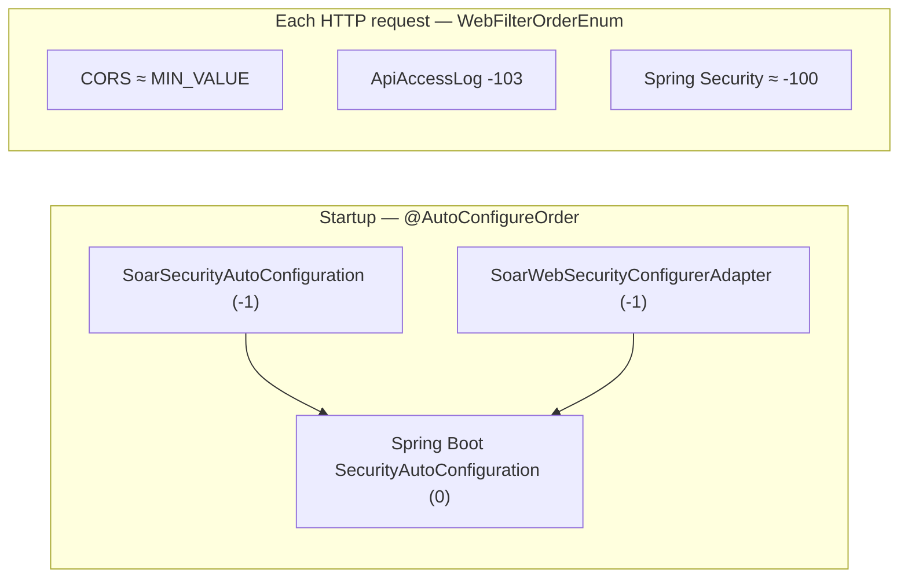

# soar-spring-boot-starter-security

Spring Boot starter that wraps **Spring Security** for Soar REST APIs. It provides **stateless OAuth2 access-token authentication**, URL-level access rules, method-level permission checks, and integration hooks for the web layer (access logs, tenant headers).

Operation-log support (`com.hdl.soar.framework.operatelog`) is reserved in this module’s structure; the current artifact focuses on authentication and authorization.

## Overview

| Component | Class | Responsibility |
|-----------|--------|----------------|
| Security beans | `SoarSecurityAutoConfiguration` | Password encoder, token filter, 401/403 handlers, `ss` permission service, TTL `SecurityContext` |
| HTTP security rules | `SoarWebSecurityConfigurerAdapter` | `SecurityFilterChain`, `permitAll` rules, `TokenAuthenticationFilter` placement |
| Token validation | `TokenAuthenticationFilter` | Read token → validate via `OAuth2TokenCommonApi` → set `LoginUser` |
| Current user (full) | `SecurityFrameworkUtils` + `LoginUser` | Read/write `SecurityContextHolder` |
| Current user (light) | `WebFrameworkUtils` (web starter) | `userId` / `userType` on `HttpServletRequest` attributes |
| Per-module URL rules | `AuthorizeRequestsCustomizer` | Each Maven module can register extra `permitAll` paths |
| Settings | `SecurityProperties` | Prefix `soar.security` |

### High-level request flow



### Two layers of protection



| Layer | Question answered | Typical failure |
|-------|-------------------|-----------------|
| URL | “Must the caller be logged in?” | `401` — not authenticated |
| Method | “Does this user have the business permission?” | `403` — forbidden |

---

## Dependencies

Add the starter to your module:

```xml
<dependency>
    <groupId>com.hdl.boot</groupId>
    <artifactId>soar-spring-boot-starter-security</artifactId>
</dependency>
```

Transitive highlights:

| Dependency | Purpose |
|------------|---------|
| `soar-common` | `OAuth2TokenCommonApi`, `PermissionCommonApi`, `CommonResult`, `WebFilterOrderEnum` |
| `soar-spring-boot-starter-web` | `WebFrameworkUtils`, `GlobalExceptionHandler`, `WebProperties` |
| `spring-boot-starter-security` | Spring Security 6 |

Runtime contracts (implemented in business modules, consumed here):

- **`OAuth2TokenCommonApi`** — `checkAccessToken(String token)` returns user id, type, tenant, scopes, etc.
- **`PermissionCommonApi`** — `hasAnyPermissions`, `hasAnyRoles` for the `ss` bean

---

## Auto-configuration

Two `@AutoConfiguration` classes are intentionally **separate** (merging them can break `AuthenticationManager` initialization). Both use `@AutoConfigureOrder(-1)` so they are applied **before** Spring Boot’s default security auto-configuration.

| Class | Registers |
|-------|-----------|
| `SoarSecurityAutoConfiguration` | `AuthenticationEntryPoint`, `AccessDeniedHandler`, `PasswordEncoder`, `TokenAuthenticationFilter`, bean `ss`, TTL `SecurityContextHolder` strategy |
| `SoarWebSecurityConfigurerAdapter` | `SecurityFilterChain`, `AuthenticationManager` bean, `@EnableMethodSecurity` |

Register them for Spring Boot 3 via  
`META-INF/spring/org.springframework.boot.autoconfigure.AutoConfiguration.imports`:

```text
com.hdl.soar.framework.security.config.SoarSecurityAutoConfiguration
com.hdl.soar.framework.security.config.SoarWebSecurityConfigurerAdapter
```

---

## Configuration: `soar.security`

Bound by `SecurityProperties` (`@ConfigurationProperties(prefix = "soar.security")`).

| Property | Default | Description |
|----------|---------|-------------|
| `token-header` | `Authorization` | Header carrying the access token (`Bearer …` supported) |
| `token-parameter` | `token` | Query parameter when headers are unavailable (e.g. WebSocket handshake) |
| `mock-enable` | `false` | Dev-only fake login (**must be `false` in production**) |
| `mock-secret` | `test` | Mock token prefix; full token = `secret` + `userId` |
| `permit-all-urls` | `[]` | Ant patterns allowed without authentication |
| `password-encoder-length` | `4` | BCrypt strength (higher = slower) |

Example (`application.yaml`):

```yaml
soar:
  security:
    permit-all-urls:
      - /admin-api/open/**   # public callbacks, etc.
    mock-enable: false        # true only on local profile
```

---

## `SecurityFilterChain` (`SoarWebSecurityConfigurerAdapter`)

### Infrastructure settings

| Setting | Value | Reason |
|---------|--------|--------|
| CORS | enabled | Browser clients |
| CSRF | disabled | No cookie session |
| Session | `STATELESS` | Token per request |
| Frame options | disabled | Some admin UIs use iframes |
| `formLogin` / `logout` | not used | Login flows live in the system/OAuth2 module |

Exception handling returns Soar **`CommonResult` JSON**:

- **`AuthenticationEntryPointImpl`** → `401` when a protected URL is called without a valid login
- **`AccessDeniedHandlerImpl`** → `403` when the user is logged in but lacks access (URL or method)

### Authorization rules (three blocks)

Spring Security **merges** multiple `.authorizeHttpRequests(...)` calls into one rule set.



**Block 1 — shared rules**

1. `GET /*.html`, `/*.css`, `/*.js`
2. URLs collected at startup from `@PermitAll` on controllers (see below)
3. `soar.security.permit-all-urls`

**Block 2 — module extensions**

Every `AuthorizeRequestsCustomizer` bean can add matchers (Swagger, Actuator, public file download, etc.).

**Block 3 — fallback**

- `DispatcherType.ASYNC` → `permitAll` (SSE / async dispatch)
- `anyRequest().authenticated()` — everything else requires a authenticated principal

### `TokenAuthenticationFilter` placement

```java
httpSecurity.addFilterBefore(authenticationTokenFilter, UsernamePasswordAuthenticationFilter.class);
```

The token filter runs **inside** the Spring Security chain **before** username/password processing, so `authenticated()` sees the user established from the Bearer token.

### `@PermitAll` scanning

At startup, `getPermitAllUrlsFromAnnotations()` walks `RequestMappingHandlerMapping` and collects paths where `@PermitAll` is on the method or controller class. If `@RequestMapping` has no HTTP method, **all** methods (GET, POST, …) are registered as anonymous.

Prefer `@PermitAll` on the controller for login/register endpoints instead of duplicating paths in YAML.

---

## Token authentication (`TokenAuthenticationFilter`)



| Step | Input | Output |
|------|--------|--------|
| Extract token | `Authorization` / `token` param | Raw token string (strip `Bearer `) |
| Resolve user type | Request path | `ADMIN` vs `MEMBER` (or null for `/ws/*`, etc.) |
| Validate | Token + optional type check | `LoginUser` or `null` |
| Mock (dev) | `mockSecret` + userId | `LoginUser` without calling OAuth2 |
| Publish user | `LoginUser` | Context + request attributes |

If the client sends a token but validation throws (e.g. wrong user type), the filter writes JSON via `GlobalExceptionHandler` and **stops** the chain.

If the token is invalid on a `permitAll` URL, validation may return `null` and the request still proceeds **without** a logged-in user.

---

## `LoginUser`, `SecurityFrameworkUtils`, and `WebFrameworkUtils`

### Concepts

| Concept | Role |
|---------|------|
| **`HttpServletRequest`** | One HTTP call; carries client headers **and** server-side attributes |
| **Token** | Proof from the client; used only in the filter to build `LoginUser` |
| **`LoginUser`** | Server-side principal: id, userType, tenantId, scopes, `info` map (nickname, deptId, …) |

### Dual storage after `setLoginUser`



Why both?

- **`SecurityContextHolder`** is the standard Spring Security store for controllers and `@PreAuthorize`.
- **Request attributes** survive for components that run **outside** or **after** the security filter unwind—especially `ApiAccessLogFilter` (`WebFilterOrderEnum.API_ACCESS_LOG_FILTER = -103`), which logs **after** `filterChain.doFilter` returns. At that moment the thread-local security context may already be cleared, but `login_user_id` on the request remains.

```java
// SecurityFrameworkUtils.setLoginUser — simplified
SecurityContextHolder.getContext().setAuthentication(authentication);
WebFrameworkUtils.setLoginUserId(request, loginUser.getId());
WebFrameworkUtils.setLoginUserType(request, loginUser.getUserType());
```

| Utility | Module | Reads / writes |
|---------|--------|----------------|
| `SecurityFrameworkUtils` | security | Token parsing; `LoginUser` via `SecurityContextHolder` |
| `WebFrameworkUtils` | web | Tenant header; **request** `userId` / `userType`; `common_result` for access logs |

---

## Method security and the `ss` bean

`@EnableMethodSecurity(securedEnabled = true)` is enabled on `SoarWebSecurityConfigurerAdapter`.

Use the **`ss`** bean (`SecurityFrameworkService`) in SpEL:

```java
@PreAuthorize("@ss.hasPermission('system:user:query')")
public CommonResult<PageResult<UserRespVO>> getUserPage(...) { ... }
```

| Method | Data source |
|--------|-------------|
| `hasPermission` / `hasAnyPermissions` | `PermissionCommonApi` + current user id |
| `hasRole` / `hasAnyRoles` | `PermissionCommonApi` |
| `hasScope` / `hasAnyScopes` | `LoginUser.scopes` |

`SecurityFrameworkUtils.skipPermissionCheck()` returns `true` when `visitTenantId ≠ tenantId` (cross-tenant visit); permission checks are skipped in that mode by design.

Inject `PasswordEncoder` for password hashing (BCrypt, strength from `password-encoder-length`).

---

## Extending URL rules per module

Implement a bean of type `AuthorizeRequestsCustomizer`:

```java
@Configuration
public class InfraSecurityConfiguration {

    @Bean
    public AuthorizeRequestsCustomizer infraAuthorizeRequestsCustomizer() {
        return new AuthorizeRequestsCustomizer() {
            @Override
            public void customize(
                    AuthorizeHttpRequestsConfigurer<HttpSecurity>.AuthorizationManagerRequestMatcherRegistry registry) {
                registry.requestMatchers("/actuator/**").permitAll()
                        .requestMatchers(buildAdminApi("/infra/file/*/get/**")).permitAll();
            }
        };
    }
}
```

Helpers:

- `buildAdminApi("/path")` → `soar.web.admin-api.prefix` + path (default `/admin-api`)
- `buildAppApi("/path")` → `soar.web.app-api.prefix` + path (default `/app-api`)

---

## Servlet filter order vs `@AutoConfigureOrder(-1)`

These are **different** mechanisms:



| Mechanism | When | Purpose |
|-----------|------|---------|
| `@AutoConfigureOrder(-1)` | Application startup | Register Soar beans **before** default security auto-config |
| `WebFilterOrderEnum` | Every request | Order CORS, body cache, API log, XSS, **then** Spring Security (~`-100`) |

---

## Package layout

```text
com.hdl.soar.framework.security
├── config
│   ├── SoarSecurityAutoConfiguration
│   ├── SoarWebSecurityConfigurerAdapter
│   ├── SecurityProperties
│   └── AuthorizeRequestsCustomizer
├── core
│   ├── LoginUser
│   ├── filter/TokenAuthenticationFilter
│   ├── handler/AuthenticationEntryPointImpl, AccessDeniedHandlerImpl
│   ├── service/SecurityFrameworkService(+Impl)  → bean name "ss"
│   ├── util/SecurityFrameworkUtils
│   └── context/TransmittableThreadLocalSecurityContextHolderStrategy
└── operatelog/   (reserved — operation logging integration)
```

---

## Usage checklist

### Public API (no login)

Pick one:

- `@PermitAll` on controller method or class
- Add path to `soar.security.permit-all-urls`
- Register `permitAll()` in an `AuthorizeRequestsCustomizer`

### Protected API

1. Client obtains access token from the OAuth2/login API (system module).
2. Send `Authorization: Bearer <access_token>` (or `?token=` when needed).
3. For admin APIs use `/admin-api/...`; for member APIs use `/app-api/...`.
4. Optionally send `tenant-id` header for multi-tenant data.
5. Annotate sensitive methods with `@PreAuthorize("@ss.hasPermission('...')")`.

### Local development (mock login)

```yaml
soar:
  security:
    mock-enable: true
    mock-secret: test
```

Request with header: `Authorization: Bearer test1` → treated as user id `1` (prefix `test` + id). **Disable in production.**

### Read current user in code

```java
// Preferred in business / security-aware code
Long userId = SecurityFrameworkUtils.getLoginUserId();
LoginUser user = SecurityFrameworkUtils.getLoginUser();

// In framework filters when you hold HttpServletRequest
Long userId = WebFrameworkUtils.getLoginUserId(request);
```

---

## Troubleshooting

| Symptom | Likely cause |
|---------|----------------|
| `401` on all APIs | Missing/invalid token on `authenticated()` URL; or filter chain not registered |
| `401` only on some APIs | URL not in `permitAll` and no token sent |
| `403` with valid token | `@PreAuthorize` failed; or admin token used on `/app-api` (user type mismatch) |
| Access log `userId` always null | `setLoginUser` not called (no token) or log read from context instead of `WebFrameworkUtils.getLoginUserId(request)` |
| `@PermitAll` ignored | Controller not scanned yet at startup; check mapping path includes API prefix |
| `AuthenticationManager` injection fails | Do not merge `SoarSecurityAutoConfiguration` and `SoarWebSecurityConfigurerAdapter` into one class |
| Mock login in production | `mock-enable: true` left enabled — security risk |

---

## Related modules

| Module | Interaction |
|--------|-------------|
| `soar-spring-boot-starter-web` | `WebFrameworkUtils`, `ApiAccessLogFilter`, `WebProperties` API prefixes |
| `soar-common` | `OAuth2TokenCommonApi`, `PermissionCommonApi`, `WebFilterOrderEnum` |
| System / OAuth2 module | Issues and validates tokens; implements `OAuth2TokenCommonApi` |
| System permission module | Implements `PermissionCommonApi` for `ss` |

---

## Design notes

- **Stateless + token**: No server session; each request is independently authenticated.
- **Login not in this starter**: Username/password or social login endpoints belong in the system module; this starter only **consumes** tokens.
- **TTL `SecurityContext`**: `TransmittableThreadLocalSecurityContextHolderStrategy` propagates context to async tasks (`@Async`, thread pools) better than plain `ThreadLocal`.
- **Fail-open on bad token for anonymous URLs**: Invalid token on `permitAll` routes does not block the request; protected routes still require a successful `setLoginUser`.
